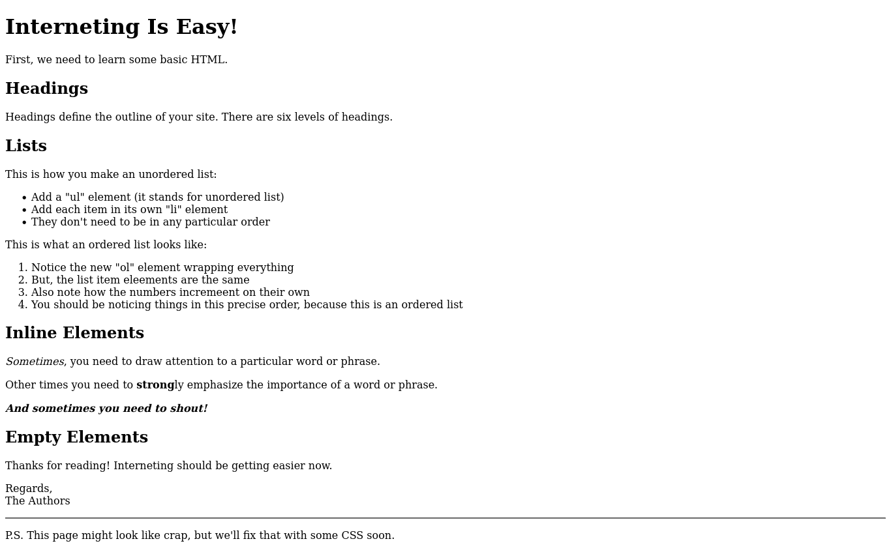

# Interneting Is Hard - Basic Web Pages

This is a solution to the [Basic Web Pages tutorial No. 2 of HTML & CSS Is Hard](https://www.internetingishard.com/html-and-css/basic-web-pages/).

## Table of contents

- [Overview](#overview)
  - [Screenshot](#screenshot)
  - [Links](#links)
- [My process](#my-process)
  - [Built with](#built-with)
  - [What I learned](#what-i-learned)
  - [Continued development](#continued-development)
  - [Useful resources](#useful-resources)
- [Author](#author)
- [Acknowledgments](#acknowledgments)

## Overview

### Screenshot



### Links

- Solution URL: (https://github.com/jugglingdev/basic-web-pages)

- Live Site URL: (https://jugglingdev.github.io/basic-web-pages/)

## My process

### Built with

- HTML5 markup

### What I learned

In this tutorial, I built my first web page with HTML5 markup.  I learned about the boilerplate tags needed in every HTML document.  I enjoyed nesting the tags to keep things organized.  I also found it interesting that `<title>` goes in the `<head>` and appears in the tab while `<h1>` can be used as the title on the webpage.

I was familiar with the levels of headings because of Word, so that part was easy.  I also appreciated the semantic meaning behind `<strong>` and `<em>` versus `<b>` and `<i>`.  Lists I had learned before when dabbling in coding a few years back.

One of the biggest aha! moments this time around was grasping that HTML is for structure and CSS is for presentation.  I like the approach to begin typing out the content/structure before diving into all the fancy formatting work.

New code snippets include:

```html
<!-- Comment -->
```

```html
<br>
```

```html
<hr>
```

### Continued development

The newest elements for me were `<br>` and `<hr>`.  While I feel comfortable with the other elements, I would like more practice with these two to help lock them in my memory.

Though it wasn't the focus of this tutorial, I would also like to continue to study markdown.  I'm sure future README.md files will cover other topics such as tables, videos, and footnotes.

### Useful resources

- [Markdown Cheatsheet](https://github.com/adam-p/markdown-here/wiki/Markdown-Cheatsheet) - This cheatsheet was helpful in creating this README.md file.  Who knew there was yet another language to learn!

## Author

- GitHub - [@jugglingdev](https://github.com/jugglingdev)

- freeCodeCamp - [@jugglingdev](https://www.freecodecamp.org/jugglingdev)

- Frontend Mentor - [@jugglingdev](https://www.frontendmentor.io/profile/jugglingdev)

- LinkedIn - [Kayla Paden](https://www.linkedin.com/in/kayla-marie-paden)

## Acknowledgments

Shoutout to Oliver James for his dedication to publishing and maintaining InternetingIsHard.com.  His tutorials were the first that really clicked for me.

Another shoutout to Adam Pritchard for his Markdown Cheatsheet and Frontend Mentor for supplying a template I could fill out.